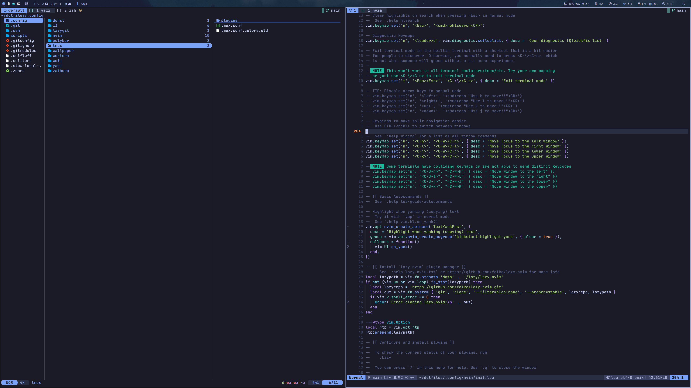

# Dotfiles

Personal configuration for a Linux desktop built around zsh, i3, neovim, and tmux.

## Setup

*WIP*

Some setup scripts for individual apps are in the [`./scripts`](./scripts/)-folder.

Using [GNU Stow](https://www.gnu.org/software/stow/) for symlink-setup in `~/.config` directory.
Run [`./scripts/stow.bash`](./scripts/stow.bash) script for setup.

## Dynamic Wallpaper

All image credit goes to [Matt Vince](https://www.mattvince.com/).

**Setup via [`./scripts/setup_wallpaper.sh`](./scripts/setup_wallpaper.sh)**.

[`scripts/set_wallpaper.sh`](./scripts/set_wallpaper.sh) selects a wallpaper based on the time of day and sunrise/sunset in Berlin.
It expects [feh](https://feh.finalrewind.org/) (to set the wallpaper), [ImageMick's](https://linux.die.net/man/1/imagemagick) `convert` (to create a blurred version for the lock-screen), and [sunwait](https://github.com/risacher/sunwait), plus the wallpaper files under [`.config/wallpaper/`](`.config/wallpaper/`).
Furthermore, a cronjob running the [`scripts/set_wallpaper.sh`](./scripts/set_wallpaper.sh)-script is configured to run every hour.